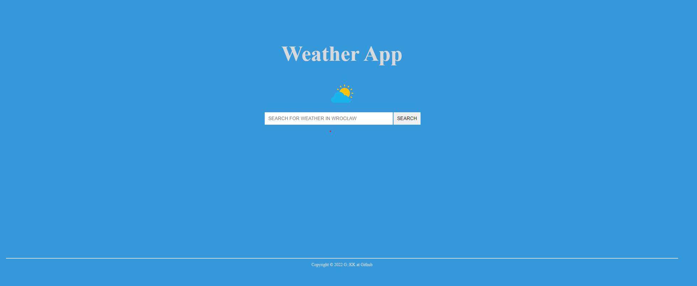
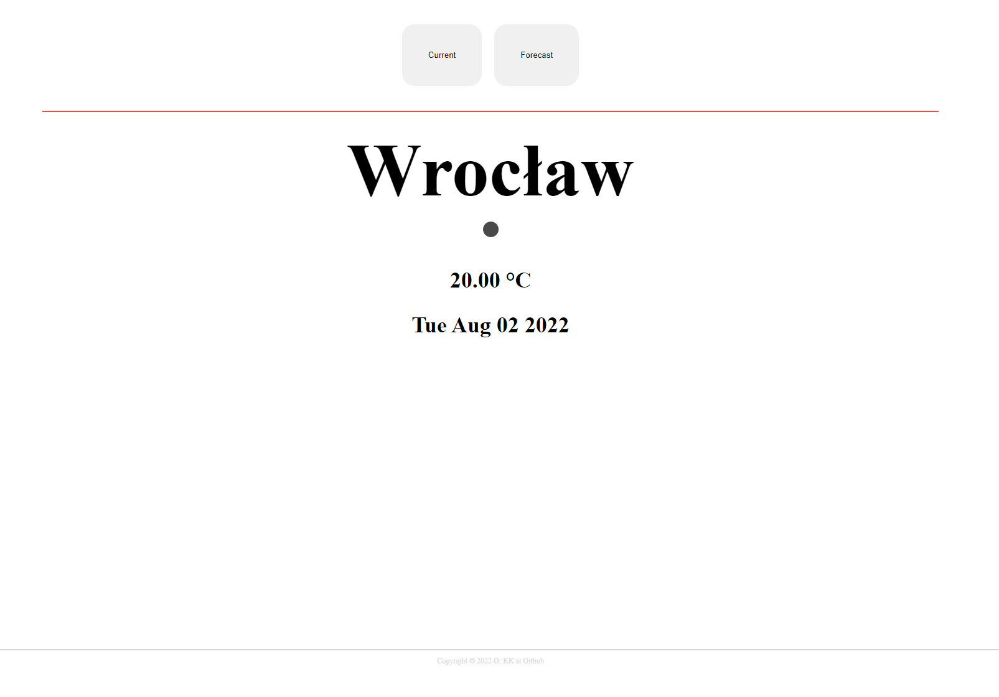
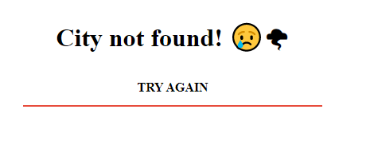

# Weather-svelte

## What's that?

Based on [react weather-app](https://github.com/Pookacz/weather-app) app (this repo) and [design](https://www.figma.com/file/yMZDGCUYZ95xXaA0EZyLib/pookacz-weather-app?node-id=0%3A1) svelte version using openstreetmap for localization and openweathermap for current weather and forecast data.

## Usage

To install dependencies:

```sh
cd weather-svelte
npm install
```

and to run start app locally

```sh
npm run dev -- --open
```

To search weather in your city just type the name and press search 😊🌤


And  here you go 😁


In case app fails to find your place you'll get city not found page so you can try search different locations near by 😅

